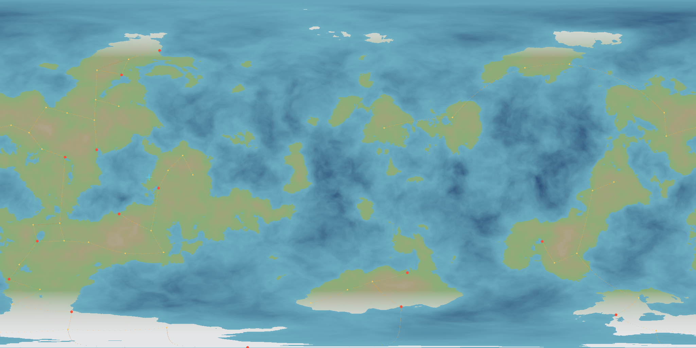
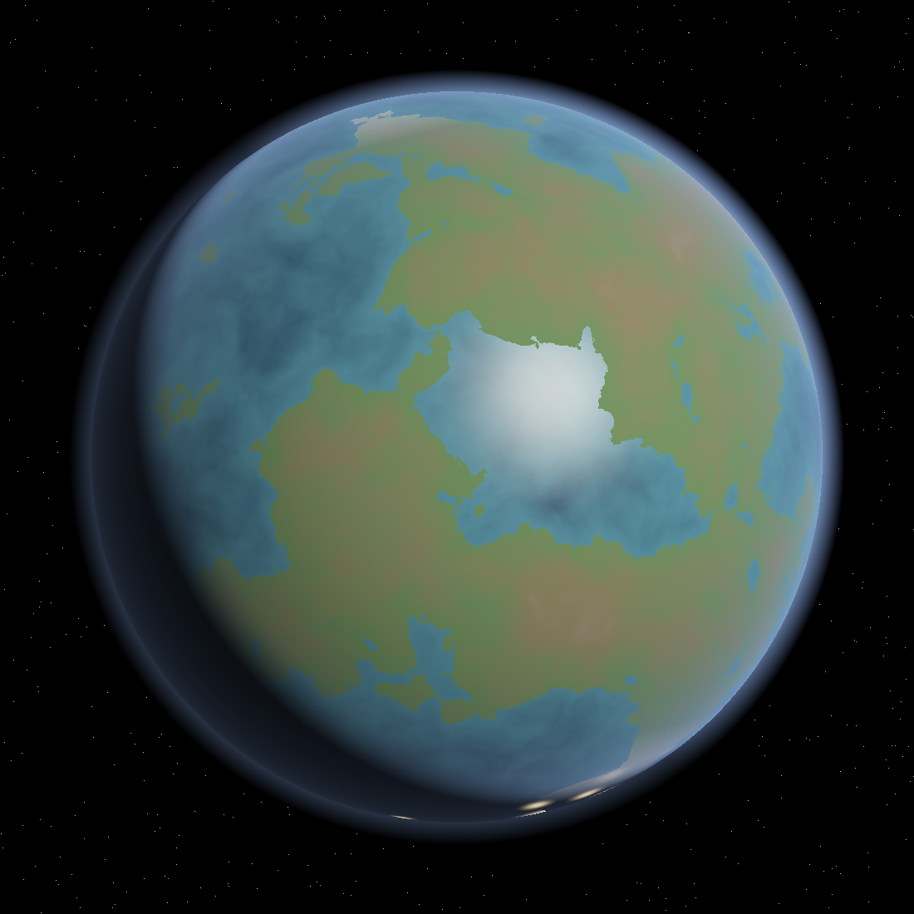
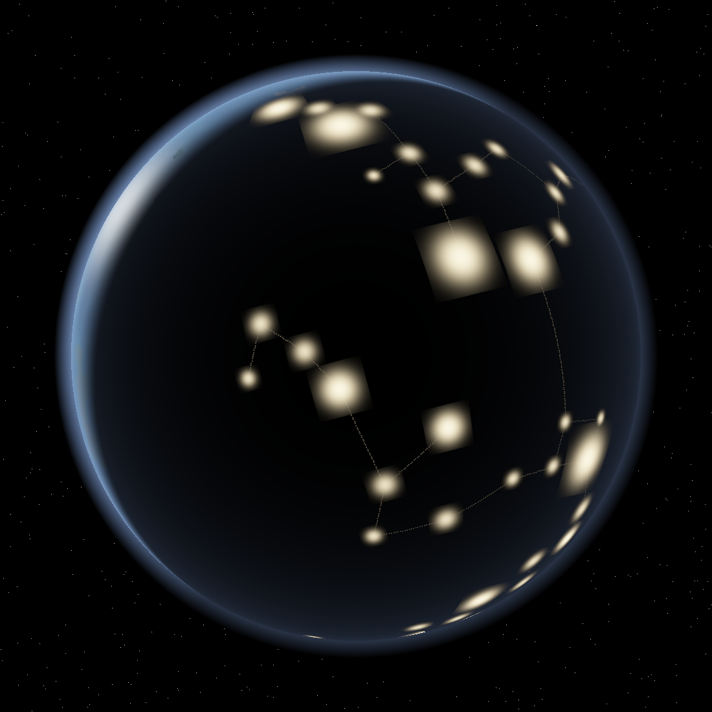
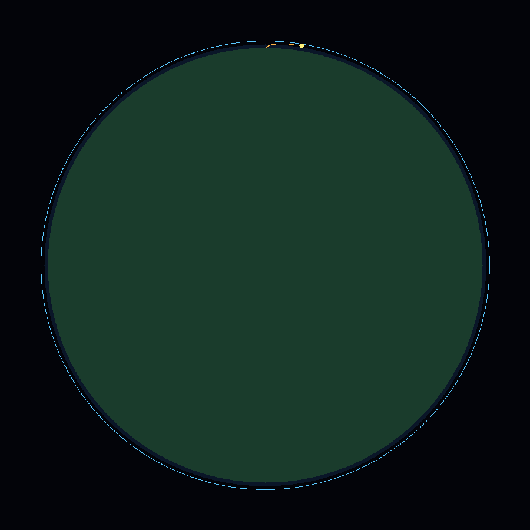
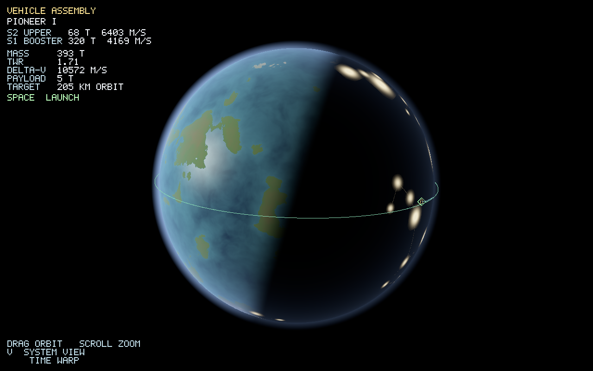
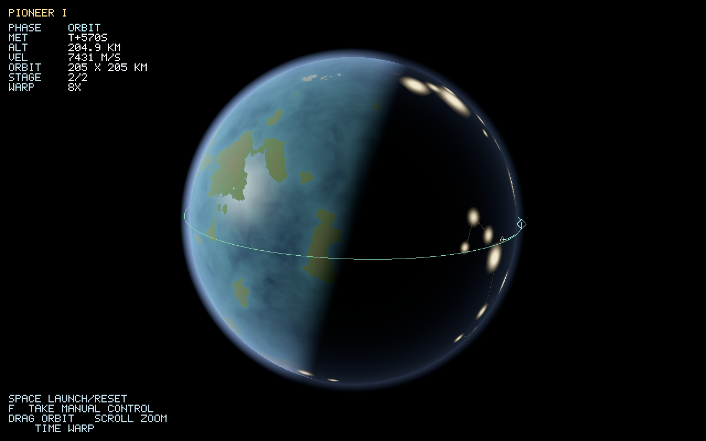
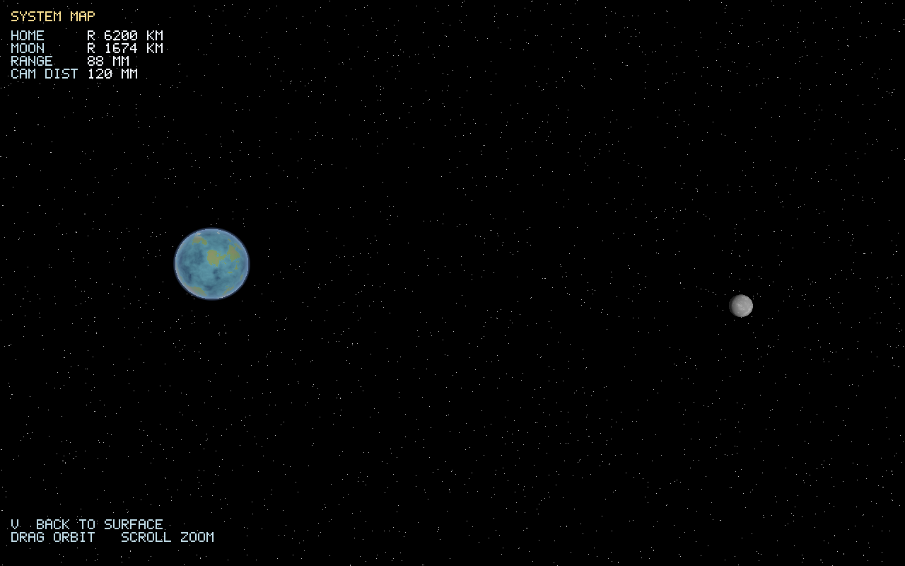
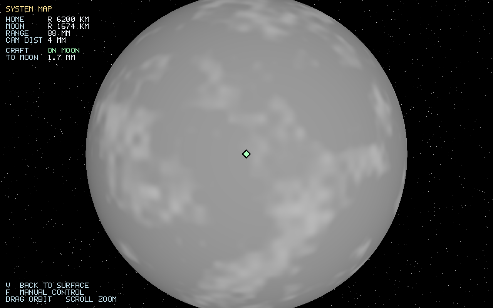

# Mining the Sky

A realistic, to-scale, multiplayer hard-sci-fi space sim set in a fictionalized
**Kepler-47** circumbinary system. Massive-scale orbital maneuvering, in-situ
resource utilization (ISRU), space industrialization, factory automation, and
advanced spaceship construction - in an async, time-compressed sandbox.

Built in **Rust** with **WebGPU (`wgpu`)**. Rendering tech (LOD, floating origin,
logarithmic depth, atmospheric scattering, scroll-wheel camera scaling, LOD
analyzer) is ported from the [Caelum](https://github.com/RubenTipparach/Caelum)
engine - minus the hex grid.

## Design

See **[docs/DESIGN.md](docs/DESIGN.md)** for the full design document covering:

- Tech stack decisions (`wgpu`, `bevy_ecs`, `aeronet`/WebTransport, `glam`, `rayon`, `tokio`)
- Rendering pipeline (icosphere quadtree LOD, log-depth, double-float floating origin, single-scattering atmosphere)
- Orbital mechanics (analytic Kepler + patched conics + GPU batch propagation - and why *not* plain RK4)
- Coordinate/time systems and async time compression
- Networking & multiplayer (QUIC, element-set replication, causal economy)
- ISRU / factory / shipbuilding gameplay
- The to-scale Kepler-47 system definition
- Roadmap and open questions

## Crates

- `crates/worldgen` - deterministic procedural home world: 3D-noise elevation,
  rivers/deltas via flow accumulation, coastal-delta major cities, river-corridor
  minor cities, a great-circle MST road network, night-light emission, and an
  auto-sited equatorial launch complex. Includes a CPU PNG preview renderer.
- `crates/terrain` - cube-sphere quadtree LOD terrain. Continuous procedural
  elevation (a pure function of sphere direction, so it is seamless across LOD
  transitions and detailed at any zoom), distance-based patch refinement, and
  crack-hiding skirts. The `lod` bin renders CPU proof images (LOD quadtree map
  + hillshaded relief). This is the foundation of the rocket-view renderer.
- `crates/sim` - orbital mechanics and launch-to-orbit: analytic two-body
  ("on-rails") state/elements, a central body + atmosphere, staged launch
  vehicles, an RK4 powered-ascent integrator with a programmed gravity turn and
  staging, and analytic circularization at apoapsis. Reaches a stable ~200 km
  orbit from the seed-47 spaceport and plots the trajectory.
- `crates/app` - the real-time client (wgpu / WebGPU) that runs natively and in
  the browser via WebAssembly. Renders the baked worldgen planet (real
  coastlines, day/night terminator, atmospheric limb, dark-side city lights)
  with a free orbit camera, a pre-launch vehicle assembly readout, the staged
  launch-to-orbit drawn live on the globe, a bitmap-font telemetry HUD, and a
  manual free-flight mode under multi-body gravity (change orbit, land on the
  home world, or transfer to and land on the moon). A perspective "system view"
  frames the home world and its moon. Includes a headless `shot` mode that
  renders a frame to a PNG (no display needed).

## Build and run

```sh
# Generate planet/city/road/night-light PNG previews into ./out
cargo run -p worldgen --bin preview --release -- 47

# Bake the world into the texture the client samples
cargo run -p worldgen --bin bake --release -- 47

# Stack a rocket, launch from the spaceport, reach orbit (writes out/launch.png)
cargo run -p sim --bin launch --release

# Run the real-time WebGPU client natively
#   drag = orbit camera, scroll = zoom, Space = launch, F = manual flight,
#   1-4 = thrust mode, W/S = throttle, V = system view, [ ] = time warp
cargo run -p app --release

# Render frames to PNGs headlessly (no window needed) for visual validation
cargo run -p app --release -- shot all                    # every feature -> ./out
cargo run -p app --release -- shot pad    out/pad.png     # pre-launch vehicle assembly
cargo run -p app --release -- shot ascent out/ascent.png  # mid powered ascent
cargo run -p app --release -- shot        out/client.png  # parking orbit
cargo run -p app --release -- shot flight out/flight.png  # manual free-flight HUD
cargo run -p app --release -- shot system out/system.png  # home world + moon
cargo run -p app --release -- shot moon   out/moon.png    # landed on the moon

# Build the browser (WASM) client locally
cd crates/app && trunk serve     # then open the printed localhost URL
```

A few generated previews (seed 47):

| Cities + roads | Day | Night (city lights) |
| --- | --- | --- |
|  |  |  |

Launch-to-orbit (Pioneer I from the seed-47 spaceport, 205 km circular orbit):



Pre-launch vehicle assembly (build and stage): the staged stack with per-stage
mass and delta-v, liftoff TWR, total delta-v, payload, and target orbit.



The real-time client (headless `shot`): Pioneer I in its parking orbit over the
day/night terminator, dark-side city lights, atmospheric limb, and the live
telemetry HUD.



System view (`V`): a perspective camera framing the home world and its moon, the
seed of the multi-body 3D renderer.



Landed on the moon: manual free-flight under multi-body gravity transfers the
craft from home orbit and touches down on the moon.



## Live demo (GitHub Pages)

`.github/workflows/pages.yml` builds the WASM client with Trunk and deploys it to
GitHub Pages on every push to `main` (same approach as Caelum's web build). To
enable it once: repo Settings -> Pages -> Source: "GitHub Actions". The demo
needs a WebGPU-capable browser.

## Status

Vertical-slice prototype complete (design doc roadmap M0-M2). End to end in the
live native/browser WebGPU client:

- Procedural home world: coastal-delta cities, river-corridor towns, a
  great-circle road network, dark-side city lights, and an auto-sited spaceport.
- Build and stage: a pre-launch vehicle assembly readout (per-stage mass and
  delta-v, TWR, payload, target orbit).
- Launch to orbit: the staged ascent flown live and drawn to scale on the globe,
  with a telemetry HUD.
- Manual free-flight under live multi-body physics (gravity + atmospheric drag +
  thrust): change orbit, deorbit, and land anywhere on the home world or, via a
  transfer, on the moon.
- A perspective system view framing the home world and its moon.
- A headless `shot` renderer for verification and the images above.

Next (the longer arc from the design doc): a guided transfer planner / maneuver
nodes; true 3D-perspective terrain and LOD (toward walkable surfaces); then the
economy loop - fundraise, launch parts (robonauts, refineries), assemble a
factory in orbit, and fabricate advanced craft to push farther out.
