# Bodies of the Kepler-47 system

A reference for every body type in the game's fictionalized **Kepler-47**
binary system, and an altitude-ladder of reference renders for the bodies that
currently have bespoke surface/visual detail. The images are the *current* look
- use them to direct the specific art pass you want for each body.

The system is generated deterministically from seed 47 (`crates/app/src/universe.rs`).
Counts: **2 stars, 13 planets, 25 moons, 15 major + 50 minor asteroids, 1 comet.**

Radii below are quoted in megametres (Mm; 1 Mm = 1000 km) to match the map scale.

---

## Detail status at a glance

| Body | Representation | Bespoke detail? | Altitude renders |
| --- | --- | --- | --- |
| Kepler-47 A (primary star) | map raymarch + corona | yes (corona shader) | portrait |
| Kepler-47 B (red dwarf) | map raymarch + corona | yes (corona shader) | portrait |
| K47-P03 - the home world | full cube-sphere LOD terrain + atmosphere | yes | 4 (orbit → surface) |
| The Moon (home's moon) | cube-sphere LOD terrain, airless | yes | 3 (high → surface) |
| Asteroids (Pallas et al.) | LOD body + procedural crater shader | yes | 4 (distant → touchdown) |
| K47-P01, P02 (rocky) | map raymarch sphere | not yet | - |
| K47-P04..P07 (gas giants) | map raymarch sphere | not yet | - |
| K47-P08..P13 (ice giants) | map raymarch sphere | not yet | - |
| Moons (24 others) | map raymarch sphere | not yet | - |
| Asteroid belt (rest) | map markers / mesh presets | partial | - |
| Comet | map marker | not yet | - |

---

## Stars

### Kepler-47 A - primary
Yellow-white main-sequence star, radius ~668 Mm (~0.96 R-sun), the system's main
light source. Rendered with a raymarched limb + corona in the map view.

### Kepler-47 B - red dwarf companion
Ruddy red dwarf, radius ~244 Mm (~0.35 R-sun). The pair orbit their barycentre
with a ~7.45-day period at ~0.0836 AU separation, so both coronae are often in
frame together.

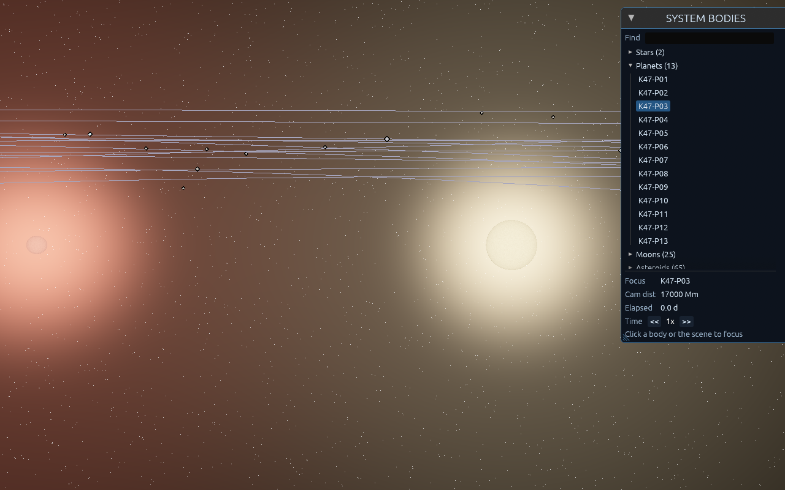
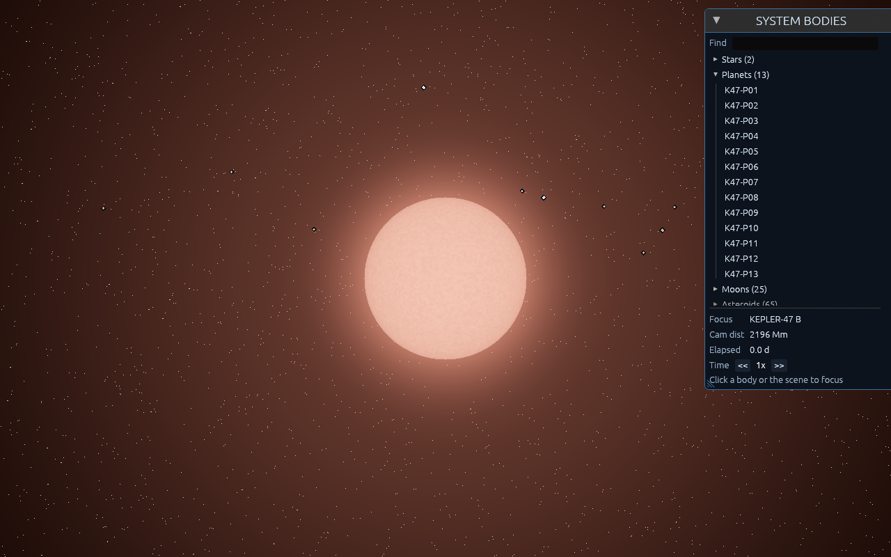

Direction notes: corona colour/intensity, chromosphere granulation, prominence
flares, and how the two coronae interact when close.

---

## K47-P03 - the home world

The habitable-zone world at 0.96 AU and the player's launch site. Earth-like:
oceans, continents, snow-capped highlands, a blue single-scattering atmosphere,
and a coastal spaceport. Rendered with the full cube-sphere quadtree LOD terrain
(seamless ground-to-orbit) plus the atmosphere shader. Radius 6.2 Mm.

Altitude ladder (space → surface):

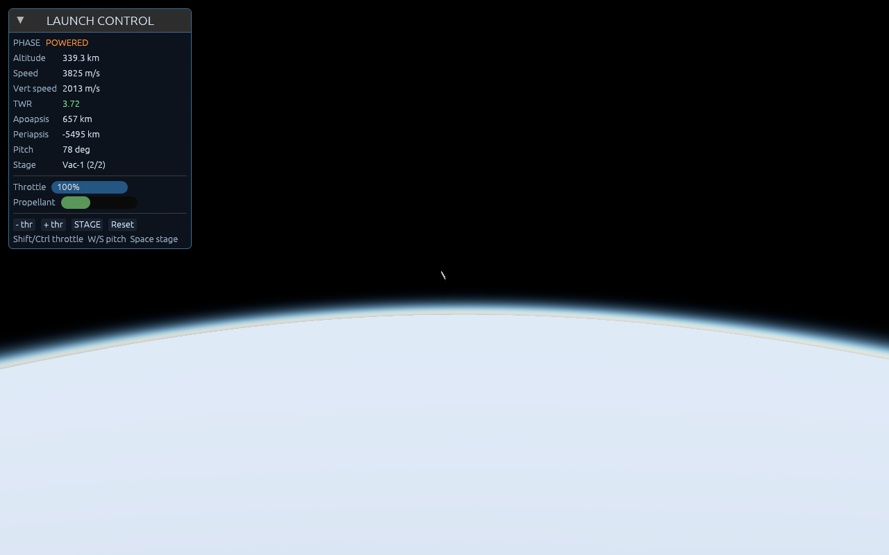
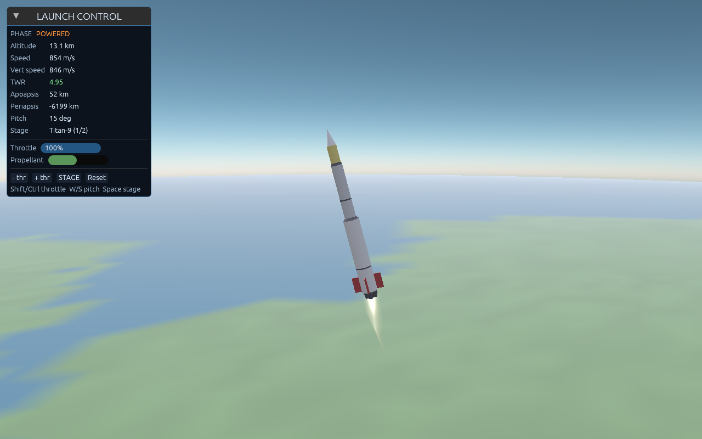
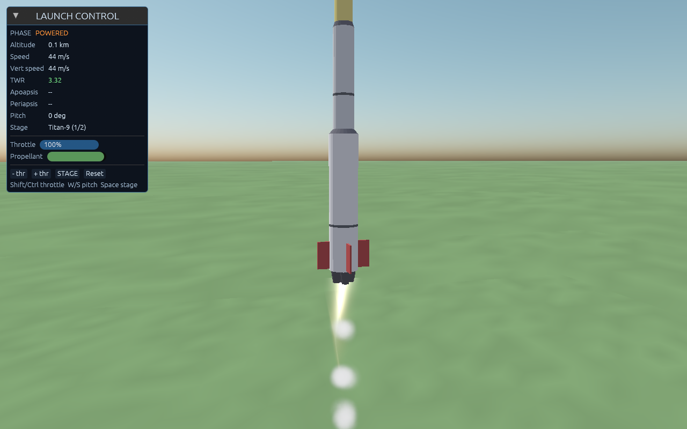
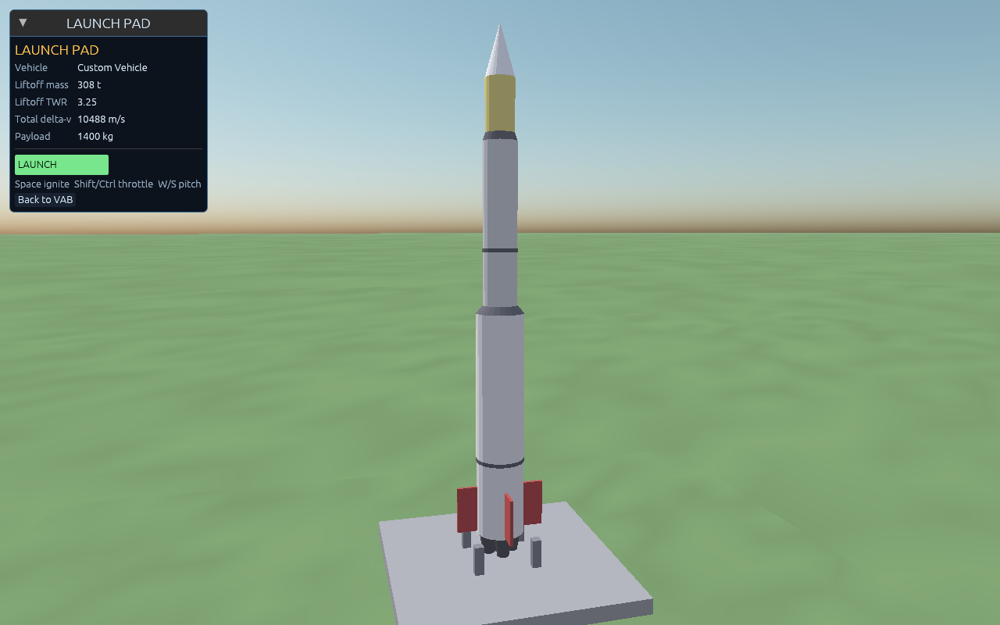

Direction notes: ocean colour/specular, coastline + biome banding, cloud layer,
atmosphere tint and limb glow, city night-lights, terrain albedo by latitude.

---

## The Moon

The home world's landable moon: a grey, airless, heavily cratered regolith body
under a black, star-flecked sky, lit by a low grazing sun for long shadows.
Rendered with the same cube-sphere LOD terrain (lunar elevation: multi-scale
impact basins over mare undulation) and the airless lighting path.

Altitude ladder (high → surface):

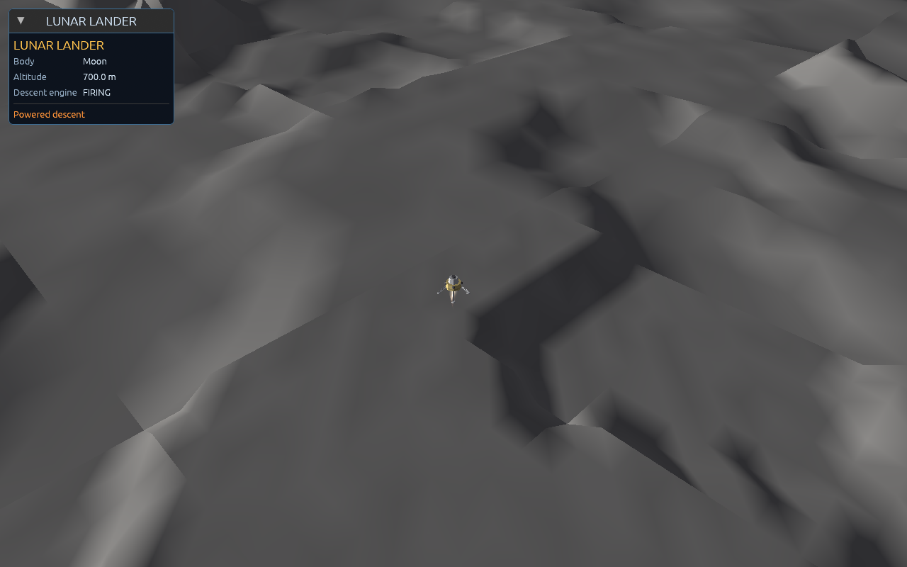
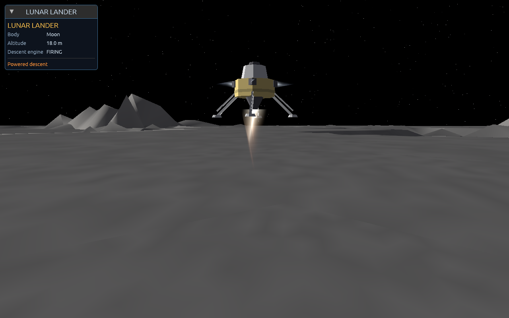
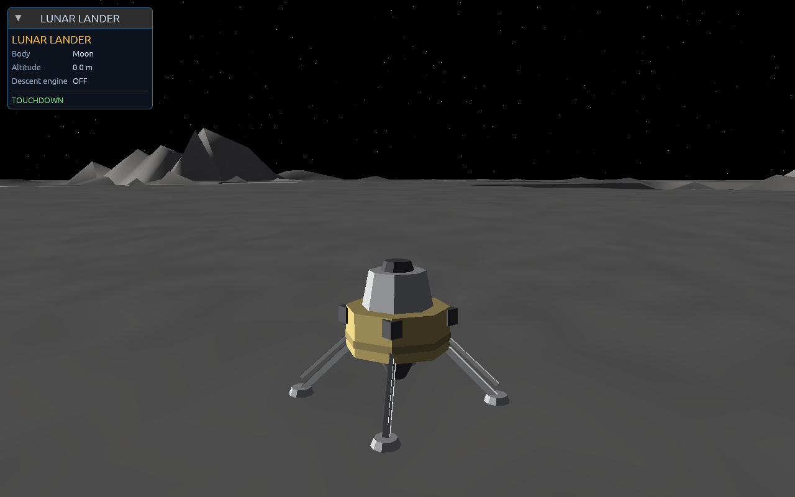

Direction notes: mare vs highland albedo, ray systems from fresh craters, rim
sharpness, regolith fines, earthshine/secondary fill on the dark side.

---

## Asteroids

Small irregular minor bodies of the 1.8-AU belt (15 major `K47-A##`, 50 minor
`K47-a##`). The detailed landable representation is a cube-sphere LOD body whose
silhouette comes from low-frequency lobes and whose surface is a procedural
**crater shader** (cellular impact field driving a normal map + ambient
occlusion), so it reads as cratered from orbit down to a pitted-but-settled
regolith at touchdown. Mean radius ~0.4 km for the reference body "Pallas".
(There are also fixed-mesh portrait presets: Hebe, Itokara, Eron.)

Altitude ladder (distant → touchdown):

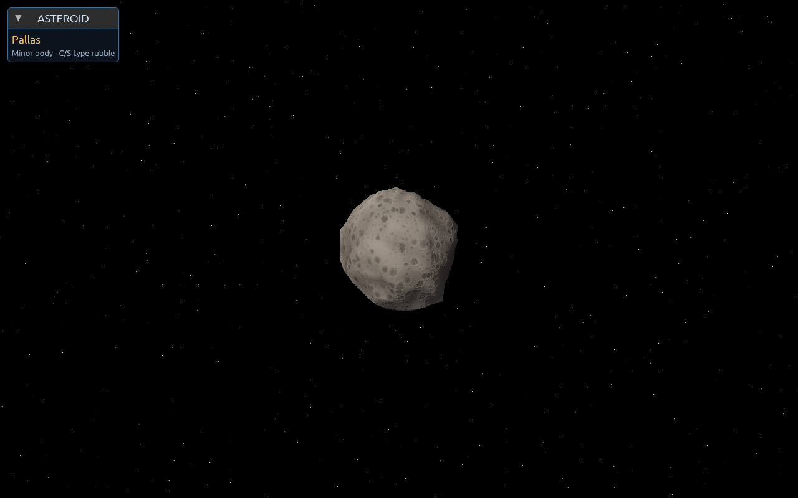
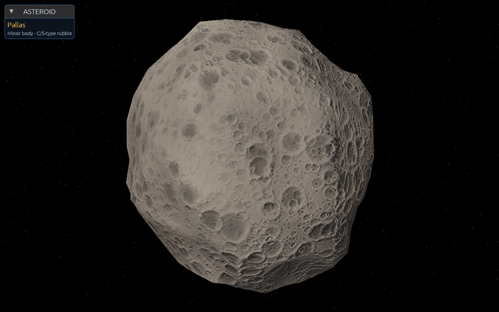
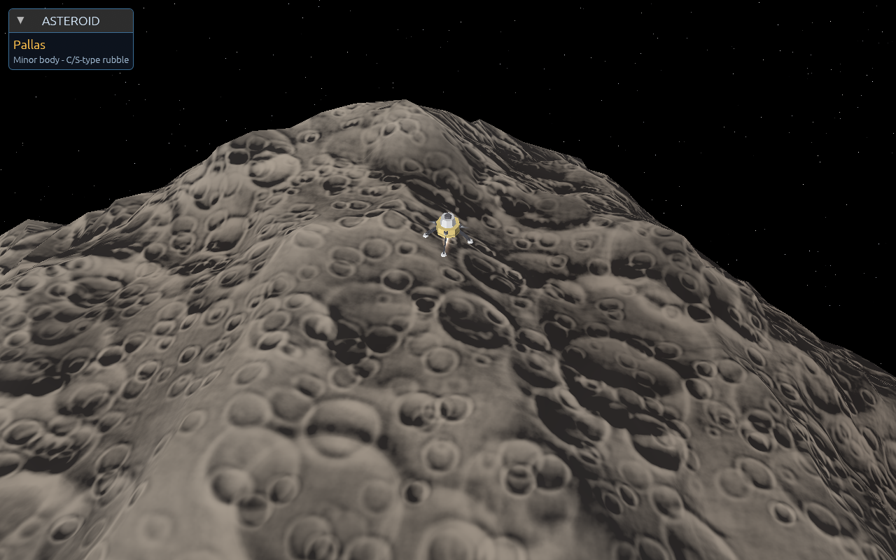
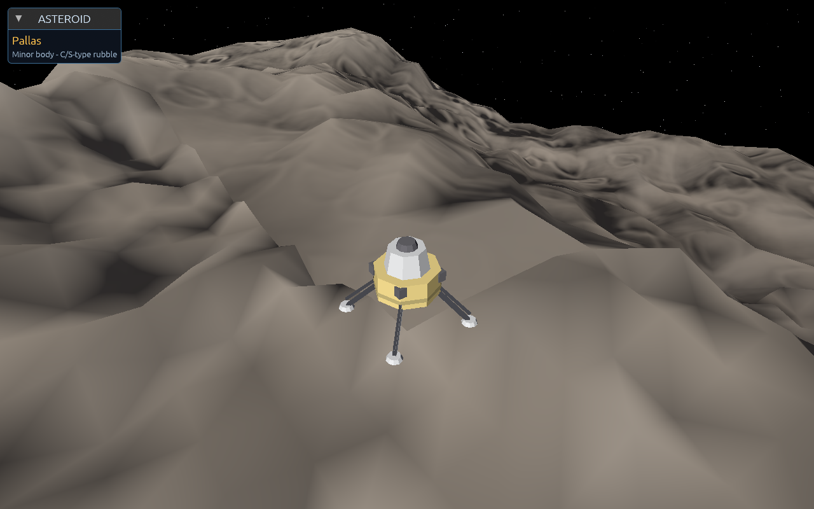

Direction notes: C- vs S-type albedo/colour, boulder fields, crater density and
freshness, grooves/regolith ponds, the smooth landing apron vs rough terrain.

---

## Planets (not yet detailed)

13 planets on near-circular orbits at semi-major axes (AU):
`0.29, 0.42, 0.96*, 1.5, 2.2, 3.1, 4.4, 6.2, 8.8, 12.5, 18.0, 27.0, 40.0`
(* = the home world, K47-P03).

- **Rocky (K47-P01, P02)** - inner worlds < 0.7 AU, radii ~3-7 Mm, dim
  brown/grey. Currently map raymarch spheres with a flat tint.
- **Gas giants (K47-P04..P07)** - 0.7-6 AU, radii ~28-72 Mm, warm cream/tan.
  Map spheres; no banding/storms yet.
- **Ice giants (K47-P08..P13)** - outer worlds, radii ~18-30 Mm, pale blue.
  Map spheres.

These are good candidates for the next detail pass (banding, storms, rings,
cloud decks). No reference renders included yet, per your request.

## Moons (not yet detailed)

25 moons distributed by parent-planet size (more around the big gas giants),
radii ~0.4-2 Mm, neutral grey. One of them is the landable Moon above; the rest
are map raymarch spheres awaiting detail.

## Asteroid belt + comet

The belt sits near 1.8 AU: 15 major and 50 minor asteroids, plus a single comet
on a longer eccentric orbit. Major asteroids can use the detailed LOD body /
mesh presets; the rest are map markers for now. The comet has no coma/tail yet.

---

## How these renders are produced

All images are rendered headlessly through the real wgpu pipeline (Mesa
lavapipe) via the `shot` scenarios, e.g.:

```
cargo run -p app --release -- shot ld_orbit out/ld_orbit.png
```

Scenario names used for the ladders above:
- Home world: `orbit`, `liftoff2`, `liftoff`, `pad`
- Moon: `m5_approach`, `m5_descent`, `m6_landed`
- Asteroid: `ld_far`, `ld_orbit`, `ld_descent`, `ld_land`
- Stars: `binary`, `starb`
